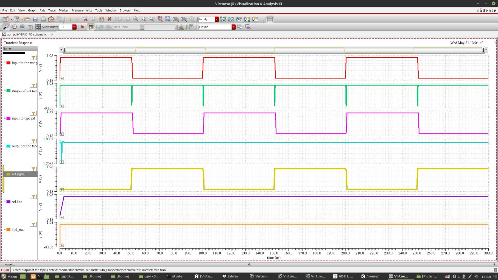
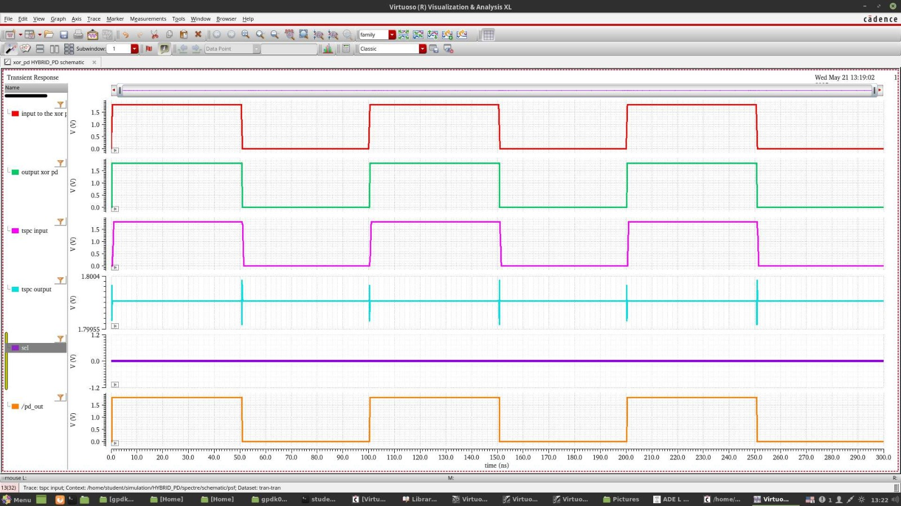

# Design and Simulation of XOR, TSPC, and MUX-Based Hybrid Phase Detectors in 45nm CMOS

## Overview

This project focuses on the design and simulation of XOR, TSPC, and MUX-based hybrid phase detectors for Phase-Locked Loop (PLL) applications using 45nm CMOS technology. The proposed architecture combines the advantages of XOR and TSPC logic to achieve accurate full-range phase detection while maintaining low power consumption and high reliability.

## Key Features

* XOR-based phase detector design
* TSPC-based phase detector implementation
* MUX-based hybrid phase detector architecture
* Full-range phase detection (0°–360°)
* Power and performance analysis
* Improved reliability and scalability for PLL systems

## Tools and Technology

* Cadence Virtuoso
* Spectre Simulator
* 45nm CMOS Technology

## Design Flow

1. Design and simulation of XOR Phase Detector
2. Design and simulation of TSPC Phase Detector
3. Integration of XOR and TSPC architectures
4. Development of MUX-based Hybrid Phase Detector
5. Performance evaluation and comparison

## Circuit Schematics

<h3>XOR Phase Detector</h3>

<h3>TSPC Phase Detector</h3>

<h3>Hybrid Phase Detector</h3>

<h3>D Flip-Flop</h3>

<h3>Simulation Results</h3>

## Results and Analysis

* Achieved complete phase detection over a 0°–360° range.
* Evaluated locking behavior under varying phase differences.
* Analyzed power consumption and phase detection accuracy.
* Demonstrated improved performance using the proposed hybrid architecture.

## Applications

* Phase-Locked Loops (PLLs)
* Frequency Synthesizers
* Clock and Data Recovery (CDR)
* Communication Systems
* High-Speed Digital Circuits

## Author

**Poorvika M R**
Electronics and Communication Engineering
